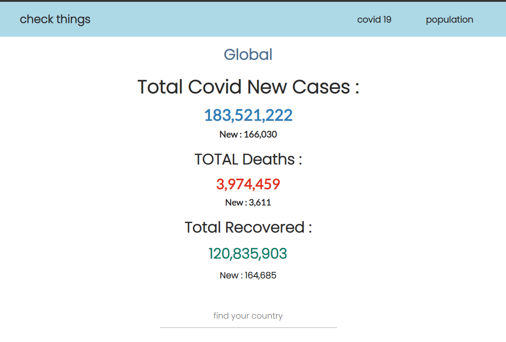

# Get the Covid-19 Live Status 

see live project in  [**live Project**](https://lab1b.github.io/covid19-cases/)



## Dependencies

Use the package manager [NPM](https://www.npmjs.com/) to install [React](https://reactjs.org/) , [Axios](https://github.com/axios/axios) and [Bootstrap](https://getbootstrap.com/)


```bash
npm install react bootstrap@4.6.0 axios
```

## Usage

```python
import foobar

foobar.pluralize('word') # returns 'words'
foobar.pluralize('goose') # returns 'geese'
foobar.singularize('phenomena') # returns 'phenomenon'
```

## Contributing
Pull requests are welcome. For major changes, please open an issue first to discuss what you would like to change.

Please make sure to update tests as appropriate.

## License
[MIT](https://choosealicense.com/licenses/mit/)
